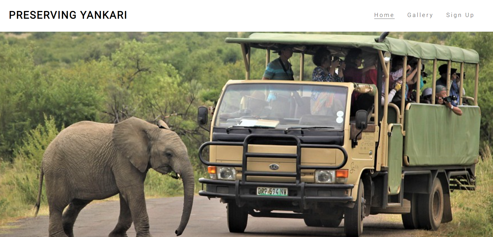
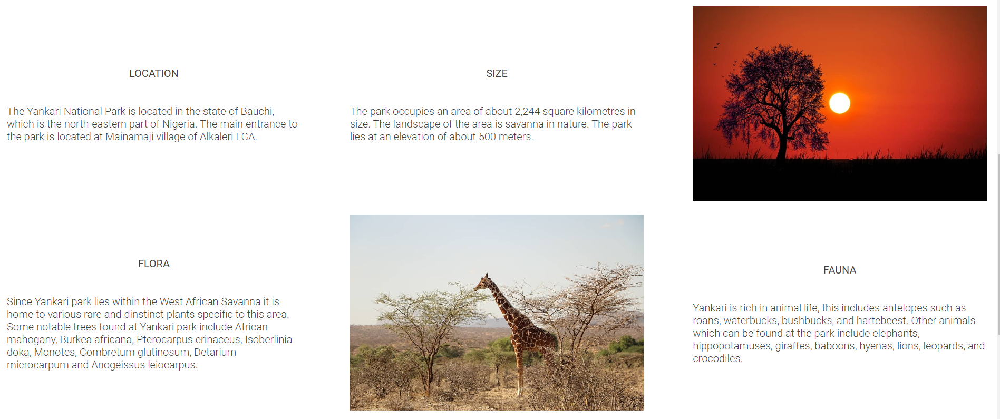
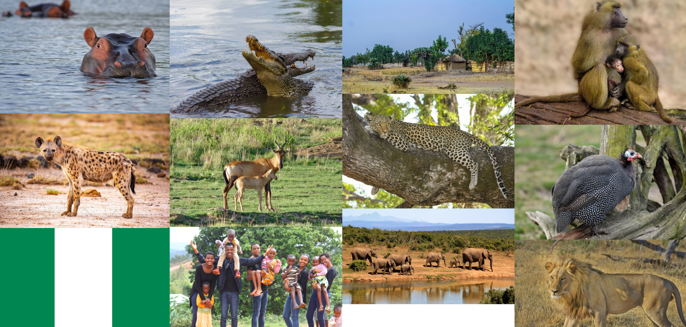
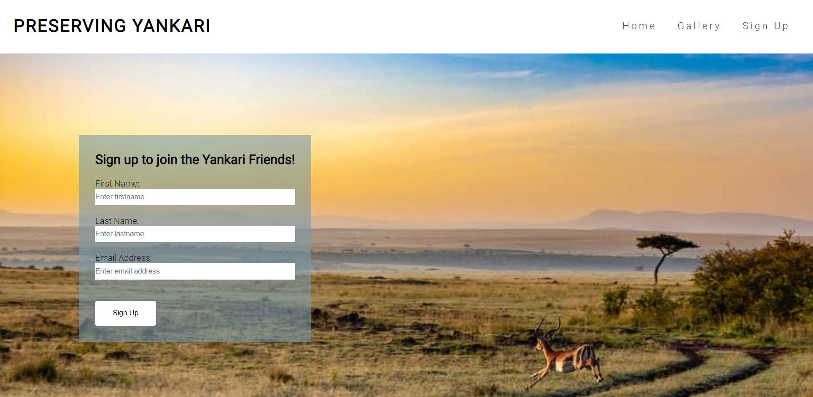

# Preserving Yankari

Preserving Yankari is a site which seeks to maintain the existence of the Yankari National Park by raising awareness about the park to the world. It highlights the attractions of the park and the threats that it faces. The site intends to target Nigerian citizens as well as foreigners such as tourists and conservationists world wide. Visitors to the site will gain information about the beauty of the park, the dangers it faces and how they can join to help sustain it.

## Features
### Existing Features
- Navigation Bar
    - The navigation bar appears on all three pages, it is responsive and has links to the Logo, the Home page, the Gallery page and the Sign Up page.
    - The navigation which is part of the header enables the site user to navigate from page to page without the need to return back to the previous page

    
- Landing page hero image
    - The landing page has a large hero image which showing the viewer what Yankari is, a wildlife park. 
    - The hero image with the animation immediately captures the attention of the user towards the site and makes them inquisitive for more.    

    
- Intro Yankari
    - The intro-yankari section introduces the user to the Yankari National park. It is divided into subsections which inform the user about the location of the park, its size, the flora and fauna, the history of the park as well as the threats it faces.
    - The user is also invited to link to the sign up page and join the supporters of the park. This information is useful for persons intrested in taking an active roll in supporting the park

    
- Footer
    - The footer contains links to social media sites. They open to a new tab to allow easy navigation for the user.
    - The footer enables and employs the user to remain connected using social media
- Gallery
    - The gallery contains various images of wildlife at the park as well group of visitors to the park.
    - The gallery images are useful because they help the user to envisage what he or she can expect to see at the park.

    
- Sign Up Page
    - This page enables users to sign up and join the Yankari park friends community. They can also opt to receive newsletters or become active members if they wish

    
### Features To Be Implemented
 - A Future Idea
    - Create a possibility for users comments and ideas to be integrated as part of a page.
## Testing
### Validator Testing
- HTML
    - No errors were detected when tested with [W3C HTML validator](https://validator.w3.org/)
- CSS 
    - No errors were detected when tested with [W3C CSS validator](https://jigsaw.w3.org/css-validator/)
### Unfixed Bugs
There was not enough time to fix the footer bug. The attempt was to make the footer stick to the bottom
## Deployment
The site was deployed to GitHub pages.
The link can be found <a href="https://peterudu.github.io/preserving-yankari/" target="_blank">
## Credits
<ul>
    <li>The photo images used on all the pages are from Pixabay This Open Source site</li>
    <li>Information about Yankari were gathered from online articles from the World Wildlife Conservation and the Yankari Game Reserve Website</li>
  
</ul>
## Other General Project Advice